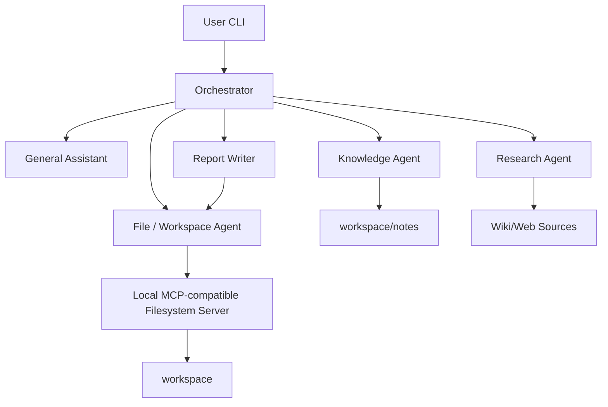
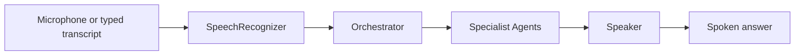

# Personal Research Assistant

Capstone implementation for Masar Applied AI Engineering.

This project is a working Python CLI Personal Research Assistant based on the earlier architecture design. It keeps the scope aligned with the assignment: a running application with an Orchestrator, specialist agents, tools, at least one MCP-style server boundary, a simple interface, README, and the three required end-to-end requests.

## Project Overview

The assistant can answer from local notes, research a wiki/web source, and save a research report into the workspace. It uses a Supervisor-Worker style architecture: the Orchestrator receives the user request, routes it to bounded specialist agents, and returns the final answer.

## How This Follows The Architecture

The earlier design is used only as background architecture guidance. The assignment is the grading source of truth. This implementation keeps the original roles but simplifies them into readable Python modules so the system is easy to run and explain.

## Architecture Diagram



## Agent Responsibilities

| Agent | Responsibility | File/module |
| --- | --- | --- |
| Orchestrator | Receives requests, classifies intent, routes work, tracks simple shared state, returns final answer | `agents/orchestrator.py` |
| General Assistant | Handles general conversation and formats final user-facing answers | `agents/general_assistant.py` |
| Knowledge Agent | Searches local notes/documents and returns cited snippets | `agents/knowledge_agent.py`, `tools/knowledge_tools.py` |
| Research Agent | Searches wiki/web sources and returns summaries with sources | `agents/research_agent.py`, `tools/research_tools.py` |
| File / Workspace Agent | Creates, reads, and updates files inside `workspace/` only | `agents/file_agent.py` |
| Report Writer | Converts research findings into Markdown reports | `agents/report_writer.py` |

## Assignment Requirements Coverage

| Requirement from PDF | Implemented file/module | How to run/test it | Status |
| --- | --- | --- | --- |
| Build a working Personal Research Assistant application based on the earlier architecture | `main.py`, `agents/` | `python main.py --demo` | implemented |
| Include an Orchestrator that receives requests, routes to specialist agents, and returns a final answer | `agents/orchestrator.py` | `python main.py --trace "What is in my note about last week's meeting?"` | implemented |
| Include a General Assistant for conversation and simple questions | `agents/general_assistant.py` | `python main.py "hello"` | implemented |
| Include a Knowledge Agent that answers from user notes/documents with citations | `agents/knowledge_agent.py`, `tools/knowledge_tools.py`, `workspace/notes/` | `python main.py "What is in my note about last week's meeting?"` | implemented |
| Include a Research Agent that searches wiki/web and summarizes with sources | `agents/research_agent.py`, `tools/research_tools.py` | `python main.py "Look up the Model Context Protocol and summarize it."` | implemented |
| Include a File Agent that can create, read, and update files in a workspace | `agents/file_agent.py`, `mcp_servers/filesystem_server.py` | `python main.py "Create file notes/demo.md with This is a demo note."` | implemented |
| Use tools | `tools/knowledge_tools.py`, `tools/research_tools.py` | covered by note and research commands | implemented |
| Use at least one MCP server | `mcp_servers/filesystem_server.py` | file commands use the filesystem server through `FileWorkspaceAgent` | implemented |
| Provide a simple interface; CLI is acceptable | `main.py` | `python main.py` | implemented |
| Include README with run/setup instructions | `README.md` | read this file | implemented |
| Handle: "What is in my note about X?" | `KnowledgeAgent`, `GeneralAssistant` | `python main.py "What is in my note about last week's meeting?"` | implemented |
| Handle: "Look up Y and summarize it." | `ResearchAgent`, `GeneralAssistant` | `python main.py "Look up the Model Context Protocol and summarize it."` | implemented |
| Handle: "Research Z and save a report to reports/z.md." | `ResearchAgent`, `ReportWriter`, `FileWorkspaceAgent` | `python main.py --force "Research the top three vector databases and save a report to reports/vector-dbs.md."` | implemented |
| Submit code plus README as a single archive | project files plus `README.md` | see `Submission` section | implemented |

## Tools And MCP Server

This project uses tools for note search, external research, and workspace file operations.

### Local MCP-compatible Filesystem Server

The assignment requires at least one MCP server. This project uses a local MCP-compatible filesystem server instead of the official MCP SDK to keep the CLI demo reliable and dependency-free.

- server: `mcp_servers/filesystem_server.py`
- client: `FileWorkspaceAgent`
- tools: `check_path_safety`, `list_files`, `read_file`, `write_file`, `update_file`, `create_directory`
- resources: files and folders inside `workspace/`
- safety: sandbox path enforcement and overwrite approval

This does not falsely claim official MCP. It preserves the key MCP idea for this capstone: filesystem tools are behind a separate server-like boundary and are not called directly by the Orchestrator or General Assistant.

## Optional Voice Bonus Implemented

The assignment also lists voice as an optional bonus. This project includes a small voice layer that sits on top of the same Orchestrator and does not replace the CLI.

### Voice Flow



### Voice Components

- `voice/asr.py`: microphone capture and speech-to-text
- `voice/tts.py`: text-to-speech and speech text cleanup
- `voice/voice_loop.py`: voice loop that wraps the existing Orchestrator
- `requirements-voice.txt`: optional packages for voice mode

### Voice Setup

```bash
pip install -r requirements-voice.txt
```

The voice bonus uses lazy imports, so the normal CLI still works without these packages.

### Voice Commands

```bash
python main.py --voice
python main.py --voice-text
python main.py --voice-text --trace
python main.py --voice-text --voice-timings
python main.py --speak "Look up the Model Context Protocol and summarize it."
```

### Voice Notes

- `--voice` uses the microphone if `SpeechRecognition` and `PyAudio` are available.
- `--voice-text` is a safe fallback for demos and grading on machines without a microphone.
- `--speak` speaks the final answer for normal CLI requests and demo mode.
- `SpeechRecognizer.recognize_google()` sends audio to Google's public speech service, so use the text fallback if privacy is a concern.
- The implementation is intentionally simple: no streaming, no barge-in, and no full duplex audio.

### OpenAI ASR Option

Google ASR remains the default provider. For more reliable microphone transcription, install the optional voice dependencies and set an OpenAI API key:

```bash
setx OPENAI_API_KEY "your_api_key_here"
pip install -r requirements-voice.txt
```

Then start microphone voice mode with OpenAI transcription:

```bash
python main.py --voice --asr-provider openai --voice-language en --voice-device-index 1 --trace --force --voice-timeout 12 --voice-phrase-limit 8 --voice-pause-threshold 1.5
```

For Arabic speech:

```bash
python main.py --voice --asr-provider openai --voice-language ar --voice-device-index 1 --trace --force --voice-timeout 12 --voice-phrase-limit 8 --voice-pause-threshold 1.5
```

Notes:

- ChatGPT subscription is separate from OpenAI API usage.
- Do not commit or share the API key.
- OpenAI ASR uses short language codes such as `en` and `ar`; values like `en-US` and `ar-SA` are mapped automatically.
- `--voice-text` remains the safest demo fallback.
- `--test-mic` can verify microphone capture without using any API.

### Voice Troubleshooting

If microphone mode records audio but hangs or fails after speaking, it is usually an online ASR/network timeout from the speech recognition service. For a reliable demo, use:

```bash
python main.py --voice-text --trace --force
```

For shorter microphone turns, try:

```bash
python main.py --voice --trace --force --voice-timeout 5 --voice-phrase-limit 6
```

For Arabic speech, use:

```bash
python main.py --voice --voice-language ar-SA --trace --force
```

For OpenAI ASR in English, use:

```bash
python main.py --voice --asr-provider openai --voice-language en --voice-device-index 1 --trace --force --voice-timeout 12 --voice-phrase-limit 8 --voice-pause-threshold 1.5
```

For OpenAI ASR in Arabic, use:

```bash
python main.py --voice --asr-provider openai --voice-language ar --voice-device-index 1 --trace --force
```

To inspect microphones first, run:

```bash
python main.py --list-mics
```

Then pick the correct index and run:

```bash
python main.py --voice --voice-device-index 1 --trace --force --voice-timeout 10 --voice-phrase-limit 8 --voice-pause-threshold 1.2
```

To verify that audio reaches Python before Google ASR, run:

```bash
python main.py --test-mic --test-mic-seconds 3 --voice-device-index 1
```

That saves `workspace/mic-test.wav` without calling online speech recognition.

## Setup

Use Python 3.10 or newer.

```bash
pip install -r requirements.txt
```

No API keys or paid services are required for the core CLI application. The optional OpenAI ASR voice mode requires an OpenAI API key.

## Run Commands

Interactive CLI:

```bash
python main.py
```

Required flows:

```bash
python main.py "What is in my note about last week's meeting?"
python main.py "Look up the Model Context Protocol and summarize it."
python main.py --force "Research the top three vector databases and save a report to reports/vector-dbs.md."
```

Expected outputs:

- Flow A: answer from notes plus citation such as `workspace/notes/last-weeks-meeting.md`
- Flow B: summary plus source URL
- Flow C: report saved plus saved path `reports/vector-dbs.md`

## Demo Mode

`--demo` is a helpful extra for evaluation convenience. It is not a separate PDF requirement.

```bash
python main.py --demo
```

It runs all three required flows and prints:

```text
=== Flow A: Personal Knowledge ===
=== Flow B: External Research ===
=== Flow C: Research and Save Report ===
```

## Trace Mode

`--trace` is a helpful extra that makes the multi-agent routing visible during a demo. It is not a separate PDF requirement.

```bash
python main.py --trace "What is in my note about last week's meeting?"
```

Trace output shows detected intent, extracted query, selected agents, tools called, safety checks, file write decisions, and final status.

## File Operation Examples

```bash
python main.py "Create file notes/demo.md with This is a demo note."
python main.py "Read file notes/demo.md"
python main.py --force "Update file notes/demo.md with Updated demo content."
python main.py "Create file ../secret.md with should not work"
```

The unsafe path command is rejected because it points outside the safe workspace.

## Safety Model

- least privilege: only the File / Workspace Agent performs file operations
- workspace sandbox: all paths must resolve inside `workspace/`
- path traversal blocking: paths like `../secret.md` are rejected
- overwrite approval: existing files require confirmation unless `--force` is used
- citations: note and research answers include visible sources

## Testing

```bash
python -m unittest discover -s tests
```

Optional syntax check:

```bash
python -m py_compile main.py voice/asr.py voice/tts.py voice/voice_loop.py agents/orchestrator.py agents/general_assistant.py agents/knowledge_agent.py agents/research_agent.py agents/file_agent.py agents/report_writer.py tools/knowledge_tools.py tools/research_tools.py mcp_servers/filesystem_server.py schemas/messages.py
```

## Submission

The submission archive should include:

- `main.py`
- `README.md`
- `requirements.txt`
- `requirements-voice.txt`
- `agents/`
- `tools/`
- `mcp_servers/`
- `schemas/`
- `voice/`
- `tests/`
- `workspace/notes/`
- `workspace/reports/`
- `DEMO_TRANSCRIPT.md`


## Demo Transcript

See `DEMO_TRANSCRIPT.md` for exact commands, sample outputs, and how each flow maps to the agents.

## Known Limitations

- The official MCP Python SDK is not used; the project uses a local MCP-compatible filesystem boundary.
- Shared state is in memory and does not persist across restarts.
- Research uses Wikipedia for the general case, official/product sources for the vector database comparison, and a small offline fallback for the MCP demo when network access is blocked.
- The CLI intent router is rule-based to keep the project simple and explainable.
- Voice mode is optional and intentionally lightweight rather than production-grade.
