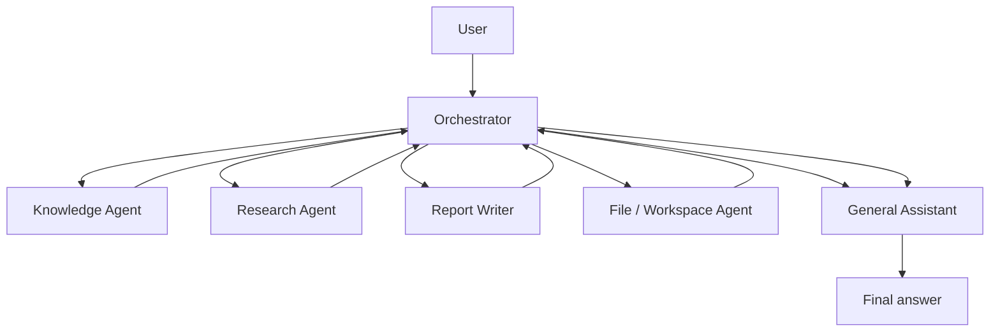

# Personal Research Assistant Architecture

## 1. System Overview

The Personal Research Assistant is a multi-agent system designed for a single knowledge worker. The user interacts with the system through one natural-language chat interface. Behind that interface, a dedicated Orchestrator receives the user's request, determines the required work, coordinates specialist agents, and returns a final response through the user-facing assistant persona.

The system must support five core capabilities:

1. General assistance and conversation for ordinary questions, clarifications, and helpful dialogue.
2. Access to the user's personal knowledge base, including notes, documents, and a small private corpus, with answers grounded in cited personal sources.
3. External research using a wiki or web source, including search, article reading, fact extraction, and source citation.
4. Safe workspace file access for creating, reading, updating, listing, and organizing files inside a sandboxed user workspace.
5. Saving research reports to user-specified files, in the requested format and path, after the relevant information has been gathered and structured.

The architecture uses the Week 2 design concepts directly. It is a multi-agent system using a Supervisor / Worker topology: the Orchestrator acts as the supervisor, while specialist agents perform bounded tasks. Agents coordinate through shared state, communicate using typed message schemas, and use MCP servers for external capabilities such as workspace file access and wiki or web research. Prompting techniques are assigned by role so that each agent has clear instructions, structured outputs, grounding requirements, and safety limits appropriate to its responsibility.

## 2. Agent Roster

| Role | Responsibility | Inputs | Outputs | Separate Agent or Capability | Design Rationale |
| --- | --- | --- | --- | --- | --- |
| Orchestrator | Receives the user request, classifies the task, creates an execution plan, routes work to specialist agents, tracks shared state, handles errors, and decides when the goal is complete. | User message, conversation state, available agent/tool descriptions, intermediate results, errors, and stop conditions. | Task plan, agent requests, merged shared state updates, final response instructions, and error or clarification requests when needed. | Separate agent. | Coordination is complex enough to require a dedicated supervisor. Keeping orchestration separate improves routing clarity, makes execution easier to debug, and prevents specialist agents from making unsafe cross-system decisions. |
| General Assistant | Maintains the user-facing assistant persona, handles general conversation and simple questions, asks clarifying questions when needed, and phrases the final answer in a helpful tone. | User message, Orchestrator instructions, completed results, citations, and final response constraints. | Conversational response, clarification question, or polished final answer for the user. | Separate user-facing persona and final-response capability used by the Orchestrator. | This role separates user communication from tool execution. It should not hold direct write permissions or risky tools, which keeps the user-facing layer safe and focused on clarity. |
| Knowledge Agent | Searches and reads the user's personal knowledge base, retrieves relevant passages, and returns grounded snippets with citations. | Knowledge query, filters such as document type or date, conversation context, and citation requirements. | Relevant snippets, source identifiers, document titles, confidence notes, and citations. | Separate specialist agent. | Personal knowledge retrieval requires source grounding and careful citation. Separating this agent reduces hallucination risk and makes it clear when an answer is based on the user's own data. |
| Research Agent | Searches an external wiki or web source, reads relevant pages, extracts facts, and records sources for later synthesis. | Research query, scope constraints, source requirements, and any entities or comparison criteria from the Orchestrator. | Sourced research findings, article metadata, extracted facts, source URLs, and unresolved questions. | Separate specialist agent. | External research involves network access and source evaluation. Keeping it separate improves auditability, supports source-grounded answers, and isolates network-facing behavior from the rest of the system. |
| File / Workspace Agent | Performs safe file operations inside the user's sandboxed workspace, including create, read, update, list, and organize operations. It writes completed reports to user-specified paths when instructed. | File operation request, workspace path, file content, overwrite policy, and safety constraints. | File contents, directory listings, write confirmations, saved file paths, or file-operation errors. | Separate specialist agent. | File writes are higher risk than reading or chatting. Isolating file permissions in one agent makes safety boundaries explicit and allows the system to require confirmation before overwriting or modifying existing files. |
| Report Writer | Converts gathered research and citations into a clean, structured document suitable for saving or returning to the user. | Research findings, knowledge snippets, requested format, target audience, report outline, citation list, and file path when applicable. | Draft report, structured Markdown or other requested document format, summary sections, comparison tables, and citation references. | Separate specialist agent. | Report generation is a distinct synthesis task. Separating it from research keeps fact gathering independent from writing, makes the report easier to review, and allows the Orchestrator to pass the finished draft to the File / Workspace Agent for saving. |

This system uses multiple specialist agents instead of one large agent because the required work spans different risk levels and skill types: conversation, private knowledge retrieval, external research, document synthesis, and file writing. Separate agents make the system safer, clearer, and easier to debug. They also improve source grounding because the Knowledge Agent and Research Agent are explicitly responsible for returning cited evidence rather than unsupported conclusions. File write permissions are isolated to the File / Workspace Agent so that no other agent can modify the user's workspace directly.

The design follows the Week 2 principle of starting with the fewest agents that work and adding an agent only when it removes a real failure. The Orchestrator is necessary for coordination, the Knowledge Agent and Research Agent separate private and external sources, the File / Workspace Agent isolates write access, and the Report Writer separates synthesis from research collection. The General Assistant remains the user-facing persona so the system can present results clearly without giving the conversational layer unnecessary tool authority.

## 3. Topology and Orchestration

The system uses a Supervisor / Worker topology. The Orchestrator is the supervisor: it receives every user request from the single chat interface, determines the user's intent, selects the appropriate specialist agents, controls the order of execution, and returns a final answer through the General Assistant. The other agents act as workers with bounded responsibilities.

Supervisor / Worker is the best fit for this project because different user requests require different combinations of agents. A simple conversational question may only need the General Assistant, while a grounded answer from personal notes requires the Knowledge Agent, and a research report saved to disk requires the Research Agent, Report Writer, and File / Workspace Agent. Central orchestration gives the system control, traceability, safety, and source grounding. It also creates one clear place to enforce step limits, source requirements, file-write safety, and human approval rules.

Other topologies are less suitable for this system:

1. A single-agent topology gives one agent too much responsibility. It would combine conversation, personal knowledge access, external research, report writing, and file operations in one place, which increases the risk of unsafe file writes, weak source grounding, and difficult debugging.
2. A sequential pipeline is too rigid because user requests vary. Not every request needs every step, and forcing all tasks through the same order would waste work and make simple interactions unnecessarily complex.
3. A network or debate topology is more flexible than needed. Allowing agents to freely communicate with each other would make the system harder to trace, harder to debug, and less appropriate for a small personal assistant with clear specialist roles.

The Orchestrator uses intent-based routing. It first classifies the user request, checks whether any required details are missing, and then invokes the smallest set of agents needed to complete the goal. If the target file path, source scope, or user intent is ambiguous, the Orchestrator asks the user a clarifying question before continuing.

| User intent | Agents invoked | Flow | Notes / safety rule |
| --- | --- | --- | --- |
| General conversation only | General Assistant | Orchestrator -> General Assistant -> user | No specialist tools are needed. The response should be conversational and concise. |
| Personal notes or user knowledge | Knowledge Agent, then General Assistant | Orchestrator -> Knowledge Agent -> General Assistant -> user | The Knowledge Agent must return cited snippets from the user's knowledge base. The final answer must cite the retrieved source. |
| External research | Research Agent, then General Assistant or Report Writer | Orchestrator -> Research Agent -> General Assistant or Report Writer -> user | The Research Agent must return sourced findings. The Orchestrator chooses General Assistant for a chat summary or Report Writer for structured output. |
| Research and save to file | Research Agent, Report Writer, File / Workspace Agent, then General Assistant | Orchestrator -> Research Agent -> Report Writer -> File / Workspace Agent -> General Assistant -> user | File writes are performed only by the File / Workspace Agent. If the target file exists, human confirmation is required before overwrite. |
| File read, list, or update request | File / Workspace Agent, then General Assistant when needed | Orchestrator -> File / Workspace Agent -> General Assistant -> user | Read and list operations stay inside the sandbox. Destructive actions or overwrites require human confirmation before execution. |

The flow is sequential when later steps depend on earlier results. For example, in a research-and-save request, the Research Agent must collect evidence before the Report Writer can synthesize a report, and the report must exist before the File / Workspace Agent can save it. The Orchestrator controls this order and checks each intermediate output before moving to the next step.

The flow may run in parallel when independent evidence can be gathered at the same time. For example, if a user asks for an answer that should use both personal notes and external sources, the Orchestrator can invoke the Knowledge Agent and Research Agent concurrently. Their results are then merged into shared state, with citations preserved separately so the General Assistant or Report Writer can distinguish personal knowledge from external research.



The Orchestrator stops when one of the defined stop conditions is reached:

1. The user's goal has been met and the final answer or saved file confirmation is ready.
2. The maximum number of orchestration steps has been reached.
3. The tool error budget has been exceeded.
4. Required source confidence has not been met.
5. Human approval is required but has not been granted.
6. The user asks the system to stop.

This section applies the Week 2 concepts of the agent loop, Supervisor / Worker topology, intent routing, step caps, and error control. The Orchestrator repeatedly plans, invokes workers, observes results, updates shared state, and decides whether to continue, clarify, recover from an error, or stop.

## 4. Request Flows

This section traces the three required example requests end to end. Each flow uses request/response communication between the Orchestrator and specialist agents. When a task changes ownership from fact gathering to document synthesis, the Orchestrator uses an explicit handoff so the next agent receives the relevant context, citations, and constraints. The General Assistant must not invent facts outside the provided findings, and all answers based on personal knowledge or external research must include citations.

### 4.1 Example A: Personal Knowledge Question

User request: "What is in my note about last week's meeting?"

This request is classified as a personal knowledge-base question. The system should answer only from the user's knowledge base and should not use external research unless the user asks for it.

Numbered flow:

1. The user sends the request through the chat interface.
2. The Orchestrator classifies the intent as `personal_knowledge_query`.
3. The Orchestrator creates a request message for the Knowledge Agent with the query text, conversation context, and citation requirement.
4. The Knowledge Agent searches the user's personal knowledge base for notes related to "last week's meeting."
5. The Knowledge Agent reads the most relevant matching note or snippets and returns cited passages, source identifiers, and a confidence note.
6. The Orchestrator updates shared state with the retrieved snippets and citations.
7. The Orchestrator sends the cited snippets to the General Assistant with instructions to answer only from those snippets.
8. The General Assistant produces the final user-facing answer with a citation to the note.
9. If no relevant note is found, the General Assistant says that no matching note was found and may ask the user for a more specific date, title, or keyword.

Agents involved:

- Orchestrator
- Knowledge Agent
- General Assistant

Tools and MCP capabilities used:

- Knowledge-base search tool or knowledge MCP resource for retrieving relevant personal documents.
- Knowledge-base read tool for reading the selected note or document snippets.
- No external web or file-write tools are used.

Shared state fields updated:

- `user_request`: Original user message.
- `intent`: `personal_knowledge_query`.
- `plan`: Retrieve relevant personal note, then answer with citations.
- `knowledge_snippets`: Matching snippets from the user's knowledge base.
- `citations`: Personal source references, such as note title, document id, section, or timestamp.
- `final_answer`: Grounded answer prepared by the General Assistant.

Final output expected:

The user receives a concise answer summarizing what the relevant meeting note says, with a citation to the personal note. If no matching note exists, the system clearly states that no relevant note was found and asks for clarification if useful.

### 4.2 Example B: External Research Summary

User request: "Look up the Model Context Protocol and summarize it for me."

This request is classified as an external research request. The user asks for a summary in chat and does not request a saved file, so the system performs research and returns the answer directly.

Numbered flow:

1. The user sends the request through the chat interface.
2. The Orchestrator classifies the intent as `external_research_summary`.
3. The Orchestrator creates a request message for the Research Agent with the topic, desired summary format, and source citation requirement.
4. The Research Agent searches a wiki or external web source for relevant pages about the Model Context Protocol.
5. The Research Agent reads the most relevant pages and extracts key facts, definitions, purpose, and important context.
6. The Research Agent returns sourced findings, source titles, URLs, and any confidence or ambiguity notes.
7. The Orchestrator updates shared state with the research findings and citations.
8. The Orchestrator sends the sourced findings to the General Assistant with instructions to summarize only from the provided research results.
9. The General Assistant produces a chat summary with citations.

Agents involved:

- Orchestrator
- Research Agent
- General Assistant

Tools and MCP capabilities used:

- Wiki or web search MCP tool for finding relevant external pages.
- Wiki or web fetch/read MCP tool for reading selected pages.
- No workspace file tools are used because the user did not ask to save the result.

Shared state fields updated:

- `user_request`: Original user message.
- `intent`: `external_research_summary`.
- `plan`: Search external sources, extract facts, then summarize in chat.
- `research_findings`: Sourced facts about the Model Context Protocol.
- `citations`: External source titles and URLs.
- `final_answer`: Chat summary produced by the General Assistant.

Final output expected:

The user receives a clear summary of the Model Context Protocol with source citations. No file is created or modified.

### 4.3 Example C: Research and Save Report

User request: "Research the top three vector databases and save a comparison report to reports/vector-dbs.md."

This request is classified as external research plus file persistence. The Orchestrator must extract the target path, gather research, produce a structured Markdown report, save it inside the safe workspace, and confirm the saved path to the user.

Numbered flow:

1. The user sends the request through the chat interface.
2. The Orchestrator classifies the intent as `research_and_save_report`.
3. The Orchestrator extracts the target file path: `reports/vector-dbs.md`.
4. If the requested source scope or comparison criteria are ambiguous, the Orchestrator asks a clarifying question. If the request is clear enough, it continues.
5. The Orchestrator sends a request to the Research Agent to identify and research three relevant vector databases using external sources.
6. The Research Agent searches wiki or web sources, reads relevant pages, and extracts sourced facts for each database, including strengths, typical use cases, and comparison criteria.
7. The Research Agent returns sourced research findings and citations to the Orchestrator.
8. The Orchestrator updates shared state and performs a handoff from the Research Agent's completed findings to the Report Writer.
9. The Report Writer creates a structured Markdown comparison report using only the provided findings and citations.
10. The Orchestrator sends the finished Markdown report and target path to the File / Workspace Agent.
11. The File / Workspace Agent runs `check_path_safety` and uses workspace metadata or `list_files` to check whether `reports/vector-dbs.md` already exists inside the safe workspace.
12. If the file exists, the Orchestrator asks the user for confirmation before overwriting. If approval is not granted, the system stops without modifying the file.
13. If the file does not exist, or overwrite approval is granted, the File / Workspace Agent writes the report to `reports/vector-dbs.md`.
14. The File / Workspace Agent returns a write confirmation and saved path.
15. The Orchestrator sends the confirmation to the General Assistant.
16. The General Assistant tells the user that the report was saved and includes a brief summary of what the report contains.

Agents involved:

- Orchestrator
- Research Agent
- Report Writer
- File / Workspace Agent
- General Assistant

Tools and MCP capabilities used:

- Wiki or web search MCP tool for finding external sources on vector databases.
- Wiki or web fetch/read MCP tool for reading selected pages.
- Workspace filesystem MCP `check_path_safety` for validating the target path.
- Workspace filesystem MCP `list_files` or workspace metadata returned by the File / Workspace Agent for detecting whether the target file already exists; there is no separate `exists` tool in this design.
- Workspace filesystem MCP `write_file` for saving the Markdown report.
- File operations are performed only by the File / Workspace Agent.

Shared state fields updated:

- `user_request`: Original user message.
- `intent`: `research_and_save_report`.
- `file_path`: `reports/vector-dbs.md`.
- `plan`: Research, synthesize Markdown report, save to file, confirm to user.
- `research_findings`: Sourced facts about the selected vector databases.
- `citations`: External source titles and URLs.
- `draft_report`: Structured Markdown report created by the Report Writer.
- `file_operation_status`: Whether the target file exists, whether overwrite approval is required, and whether the write succeeded.
- `final_answer`: Confirmation message prepared by the General Assistant.

Final output expected:

The user receives a confirmation that the comparison report was saved to `reports/vector-dbs.md`, along with a brief summary of the report contents. If the file already exists and the user does not approve overwriting it, the final answer should state that no file was changed.

| Example | Request type | Main agents | MCP/tools used | Final result |
| --- | --- | --- | --- | --- |
| A | Personal knowledge question | Orchestrator, Knowledge Agent, General Assistant | Knowledge-base search and read tools | Chat answer grounded in the user's note, with citation; or a clear no-match response. |
| B | External research summary | Orchestrator, Research Agent, General Assistant | Wiki/web search and fetch/read MCP tools | Chat summary with external source citations; no file written. |
| C | Research and save report | Orchestrator, Research Agent, Report Writer, File / Workspace Agent, General Assistant | Wiki/web search and fetch/read MCP tools; workspace filesystem `check_path_safety`, `list_files`, and `write_file` tools | Markdown comparison report saved to `reports/vector-dbs.md`, followed by user confirmation. |

## 5. Shared State and Persistence

The system uses a shared state object similar to LangGraph's state model. The Orchestrator owns the shared state and is responsible for passing the right subset of fields to each specialist agent. Agents do not directly mutate global state. Instead, each agent reads only the fields needed for its task and returns a partial update. The Orchestrator then validates and merges those updates using defined merge rules.

This approach keeps coordination explicit. The Knowledge Agent can update retrieved personal snippets, the Research Agent can add sourced findings, the Report Writer can replace the draft report, and the File / Workspace Agent can update file operation status. The Orchestrator remains the authority that decides which updates are accepted and when the flow should continue, branch, ask for clarification, or stop.

| Field | Type | Updated by | Merge strategy | Purpose |
| --- | --- | --- | --- | --- |
| `conversation_id` | string | Chat system or Orchestrator | Replace only at conversation start | Identifies the conversation and keeps it separate from other conversations. |
| `user_id` | string | Chat system or Orchestrator | Replace only at conversation start | Identifies the single knowledge worker who owns the workspace and knowledge base. |
| `messages` | list of message objects | User, General Assistant, Orchestrator | Append | Stores the conversation history and important system messages. |
| `user_request` | string | Orchestrator | Replace | Stores the current user request being handled. |
| `intent` | string | Orchestrator | Replace | Stores the classified request type used for routing. |
| `plan` | list of steps or structured plan object | Orchestrator | Replace | Stores the current execution plan and agent order. |
| `active_agents` | list of strings | Orchestrator | Replace | Tracks which agents are currently assigned to the request. |
| `knowledge_snippets` | list of cited snippets | Knowledge Agent | Append | Stores retrieved personal knowledge evidence. |
| `research_findings` | list of sourced findings | Research Agent | Append | Stores external research facts and summaries. |
| `citations` | list of citation objects | Knowledge Agent, Research Agent, Report Writer | Append and deduplicate by source id or URL | Preserves evidence references for final answers and reports. |
| `draft_report` | string or document object | Report Writer | Replace with latest approved draft | Stores the current structured report before saving or presenting. |
| `file_path` | string | Orchestrator, File / Workspace Agent | Replace | Stores the target path for file operations such as `reports/vector-dbs.md`. |
| `file_operation_status` | object | File / Workspace Agent | Replace | Stores file existence checks, write results, errors, and saved path confirmation. |
| `final_answer` | string | General Assistant | Replace | Stores the final user-facing response. |
| `errors` | list of error objects | Orchestrator, specialist agents, tools | Append | Records tool failures, validation failures, missing sources, and recovery attempts. |
| `approvals` | list or object | User, Orchestrator | Append or replace depending on approval type | Stores human approval decisions such as overwrite approval or delete confirmation. |

Reducers matter because multiple agents may produce useful updates during the same user request. Without explicit merge rules, one agent could accidentally overwrite another agent's output. Append fields preserve history, evidence, and auditability. For example, `knowledge_snippets`, `research_findings`, `citations`, `messages`, and `errors` should keep prior entries unless the Orchestrator intentionally resets the request. Replace fields keep only the latest authoritative value. For example, `intent`, `plan`, `draft_report`, `file_path`, `file_operation_status`, and `final_answer` should represent the current decision or final artifact, not every intermediate version.

Persistence is handled through checkpoints. In development, the system can use a checkpointer similar to LangGraph's `MemorySaver` to store state during a running session. In production, state should be persisted to durable storage such as SQLite, Postgres, or Redis. The system saves state after every major node or agent step, including intent classification, tool results, research completion, report draft creation, file approval, file write, and final answer generation.

Each checkpoint is keyed by `conversation_id` or `thread_id`. This prevents one conversation's memory, files, research findings, or approvals from leaking into another conversation. If the system crashes, the Orchestrator can resume by loading the latest checkpoint for the same thread, inspecting the last completed step, and continuing from the next safe action. For file writes, the Orchestrator must re-check file status after resume before writing, because the workspace may have changed while the system was offline.

Human-in-the-loop review is required in the following cases:

1. Before overwriting an existing file.
2. Before deleting files.
3. Before writing outside an allowed sandbox path.
4. When source confidence is low but the user asked to save a report.

The approval decision is stored in the `approvals` field with the approval type, target resource, decision, timestamp, and user identity. The Orchestrator checks this field before allowing the File / Workspace Agent to perform any protected operation.

Example state snapshot after Example C, before file writing:

```json
{
  "conversation_id": "thread-1042",
  "user_id": "user-001",
  "user_request": "Research the top three vector databases and save a comparison report to reports/vector-dbs.md.",
  "intent": "research_and_save_report",
  "plan": ["research vector databases", "write markdown report", "save report", "confirm to user"],
  "active_agents": ["Research Agent", "Report Writer", "File / Workspace Agent"],
  "research_findings": [
    {"topic": "Vector database A", "summary": "Key sourced findings..."},
    {"topic": "Vector database B", "summary": "Key sourced findings..."},
    {"topic": "Vector database C", "summary": "Key sourced findings..."}
  ],
  "citations": [
    {"source_id": "src-1", "title": "External source", "url": "https://example.com/vector-db"}
  ],
  "draft_report": "# Vector Database Comparison\n\nStructured Markdown report...",
  "file_path": "reports/vector-dbs.md",
  "file_operation_status": {"exists": true, "requires_approval": true, "written": false},
  "approvals": [],
  "errors": []
}
```

This section applies the Week 2 LangGraph concepts of shared state, reducers, conditional flow, checkpointers, and `thread_id`. Shared state lets agents coordinate without uncontrolled direct communication, reducers define how concurrent or sequential updates are combined, conditional flow determines whether to continue or ask for approval, and checkpointers allow reliable resume after failure.

## 6. Communication Schema

Agents communicate using typed messages rather than unstructured free text. Free text can drift over time, become ambiguous, and make it difficult to determine whether an agent returned the expected result. Typed messages create explicit boundaries between agents. They can be validated before execution, routed reliably because the sender, recipient, and message type are explicit, and traced during debugging because every message has an `id` and `correlation_id`.

This design treats agent-to-agent communication like an internal API. The Orchestrator can inspect a message, validate its envelope, validate the payload shape for the requested action, route it to the correct recipient, and record the result in shared state. This makes failures easier to detect and prevents specialist agents from acting on incomplete or malformed requests.

The message envelope uses a Pydantic-style schema:

```python
class AgentMessage(BaseModel):
    id: str
    correlation_id: str
    sender: str
    recipient: str
    type: Literal["request", "response", "handoff", "error"]
    payload: dict
    timestamp: datetime
```

| Field | Type | Required | Purpose |
| --- | --- | --- | --- |
| `id` | string | Yes | Unique identifier for this specific message. Used for tracing and debugging. |
| `correlation_id` | string | Yes | Groups related messages from the same user request or orchestration step. A request and its response share the same correlation id. |
| `sender` | string | Yes | The agent or system component that created the message. |
| `recipient` | string | Yes | The target agent or component that should handle the message. |
| `type` | enum | Yes | Message category. Allowed values are `request`, `response`, `handoff`, and `error`. |
| `payload` | object | Yes | The structured task data, result data, handoff context, or error details. The expected shape depends on message type and recipient. |
| `timestamp` | datetime string | Yes | Time when the message was created. Used for ordering, audit logs, and debugging. |

The system uses four communication patterns:

1. Request/Response: Used when the Orchestrator asks a specialist agent to perform work and waits for a result. For example, the Orchestrator sends a research request to the Research Agent, and the Research Agent returns sourced findings.
2. Handoff: Used when responsibility moves from one stage to another with context attached. In the research-and-save flow, completed research context is handed off to the Report Writer so it can create the Markdown report.
3. Blackboard / Shared State: Used through the shared state object. Agents return partial updates, and the Orchestrator merges them into shared state using the reducers defined in Section 5.
4. Broadcast: Not used in the initial design. It could be added later for notifications, monitoring hooks, or parallel event listeners, but the initial system does not need broadcast communication because the Orchestrator controls routing directly.

Example 1: request from Orchestrator to Research Agent.

```json
{
  "id": "msg-1001",
  "correlation_id": "req-mcp-summary-001",
  "sender": "Orchestrator",
  "recipient": "Research Agent",
  "type": "request",
  "payload": {
    "task": "external_research",
    "query": "Model Context Protocol",
    "source_scope": "wiki_or_web",
    "required_outputs": ["summary_facts", "citations"],
    "citation_required": true
  },
  "timestamp": "2026-07-09T10:15:00Z"
}
```

Example 2: matching response from Research Agent to Orchestrator.

```json
{
  "id": "msg-1002",
  "correlation_id": "req-mcp-summary-001",
  "sender": "Research Agent",
  "recipient": "Orchestrator",
  "type": "response",
  "payload": {
    "status": "completed",
    "research_findings": [
      {
        "claim": "The Model Context Protocol defines a standard way for AI applications to connect with external tools, data sources, and services.",
        "source_id": "src-mcp-001"
      },
      {
        "claim": "It is designed to make context and tool access more consistent across client applications and servers.",
        "source_id": "src-mcp-002"
      }
    ],
    "citations": [
      {
        "source_id": "src-mcp-001",
        "title": "Model Context Protocol overview",
        "url": "https://example.com/mcp-overview"
      },
      {
        "source_id": "src-mcp-002",
        "title": "MCP technical documentation",
        "url": "https://example.com/mcp-docs"
      }
    ]
  },
  "timestamp": "2026-07-09T10:15:20Z"
}
```

Optional example: handoff from Research Agent context to Report Writer for Example C.

```json
{
  "id": "msg-2003",
  "correlation_id": "req-vector-report-001",
  "sender": "Orchestrator",
  "recipient": "Report Writer",
  "type": "handoff",
  "payload": {
    "handoff_from": "Research Agent",
    "research_findings": [
      {
        "topic": "Vector database A",
        "facts": ["Sourced capability summary", "Sourced use-case summary"],
        "source_ids": ["src-vdb-001"]
      },
      {
        "topic": "Vector database B",
        "facts": ["Sourced capability summary", "Sourced use-case summary"],
        "source_ids": ["src-vdb-002"]
      },
      {
        "topic": "Vector database C",
        "facts": ["Sourced capability summary", "Sourced use-case summary"],
        "source_ids": ["src-vdb-003"]
      }
    ],
    "citations": [
      {"source_id": "src-vdb-001", "url": "https://example.com/vector-a"},
      {"source_id": "src-vdb-002", "url": "https://example.com/vector-b"},
      {"source_id": "src-vdb-003", "url": "https://example.com/vector-c"}
    ],
    "requested_format": "Markdown comparison report",
    "file_path": "reports/vector-dbs.md"
  },
  "timestamp": "2026-07-09T10:20:00Z"
}
```

Validation and error-handling rules:

1. If a required envelope field is missing, the system rejects the message and returns an `error` message to the sender.
2. If the `recipient` is unknown, the message is routed to the Orchestrator as an error so it can decide whether to retry, ask for clarification, or stop.
3. If the `payload` does not match the expected schema for the message type and recipient, the recipient must not execute the request.
4. If a tool fails, the specialist agent returns an `error` message with failure details in the payload, including the failed tool name, error category, and whether retry is safe.
5. The Orchestrator records all errors in the shared state's `errors` field and applies the error budget defined in the orchestration rules.

Example error message:

```json
{
  "id": "msg-3001",
  "correlation_id": "req-vector-report-001",
  "sender": "File / Workspace Agent",
  "recipient": "Orchestrator",
  "type": "error",
  "payload": {
    "error_code": "WRITE_REQUIRES_APPROVAL",
    "message": "The target file already exists and overwrite approval has not been granted.",
    "tool": "workspace.write_file",
    "retryable": true
  },
  "timestamp": "2026-07-09T10:21:00Z"
}
```

This section applies the Week 2 Agent Communication Schema concepts: typed messages, message envelopes, request/response, handoff, blackboard-style shared state, and `correlation_id`. Together, these rules make the system easier to implement, test, trace, and recover when an agent or tool returns an unexpected result.

## 7. Tools and MCP Servers

Tools are the actions or external capabilities agents can use to complete a user request. The design keeps risky tools separated by agent role so that each agent receives only the capabilities it needs. The Orchestrator routes work, validates messages, and merges state, but it should not directly perform workspace writes or external research itself. File write permissions are isolated to the File / Workspace Agent, and external network access is isolated to the Research Agent.

| Agent | Tool | Description | Risk tag | Plain local tool or MCP | Safety rule |
| --- | --- | --- | --- | --- | --- |
| Orchestrator | `classify_intent` | Classifies the user's request into a routing intent. | read | Plain local tool | Does not access external systems or user files. |
| Orchestrator | `create_plan` | Creates the ordered plan of agents and steps for the request. | read | Plain local tool | Must choose the smallest agent set that satisfies the goal. |
| Orchestrator | `validate_agent_message` | Validates typed message envelopes and payload shape. | read | Plain local tool | Reject malformed or unknown-recipient messages before execution. |
| Orchestrator | `merge_state_update` | Applies reducer rules to partial updates returned by agents. | read | Plain local tool | Must not allow one agent to overwrite protected shared state fields incorrectly. |
| General Assistant | `compose_final_answer` | Produces the final user-facing answer from approved state fields. | read | Plain local tool | Must not invent facts outside provided findings and citations. |
| General Assistant | `ask_clarifying_question` | Asks the user for missing intent, source scope, path, or approval. | read | Plain local tool | Should ask only when needed to proceed safely or correctly. |
| Knowledge Agent | `search_personal_kb` | Searches the user's private notes and documents. | read | MCP | Read-only access; results must include source identifiers. |
| Knowledge Agent | `read_personal_source` | Reads a selected note or document snippet from the personal knowledge base. | read | MCP | Read-only access; returned snippets must be citable. |
| Research Agent | `wiki_search` | Searches a wiki or approved external web source. | network | MCP | Must follow source allowlists, rate limits, and citation requirements. |
| Research Agent | `wiki_fetch_article` | Fetches and reads selected external articles or pages. | network | MCP | Must capture page metadata and source URL. |
| Research Agent | `extract_sourced_facts` | Extracts relevant facts from fetched article text. | read | Plain local tool | Must preserve links between claims and source ids. |
| Report Writer | `generate_report_outline` | Creates a structure for the requested report. | read | Plain local tool | Must use only the provided research findings and user requirements. |
| Report Writer | `draft_markdown_report` | Writes a Markdown report from sourced findings and citations. | read | Plain local tool | Must include citations for factual claims. |
| Report Writer | `verify_citation_coverage` | Checks that important claims in the draft are covered by citations. | read | Plain local tool | Must flag unsupported claims before the report is saved. |
| File / Workspace Agent | `list_files` | Lists files or directories inside the workspace sandbox. | read | MCP | Must remain inside the allowed workspace root. |
| File / Workspace Agent | `read_file` | Reads a file inside the workspace sandbox. | read | MCP | Must pass path safety checks before reading. |
| File / Workspace Agent | `write_file` | Writes a new file or writes approved content to a target path. | write | MCP | Requires sandbox validation; overwrite requires human approval. |
| File / Workspace Agent | `update_file` | Updates an existing file inside the workspace sandbox. | write | MCP | Requires sandbox validation and approval for destructive changes. |
| File / Workspace Agent | `create_directory` | Creates a directory inside the workspace sandbox. | write | MCP | Must pass path safety checks and stay inside the workspace. |
| File / Workspace Agent | `check_path_safety` | Validates that a path is inside the allowed workspace sandbox. | read | MCP | Must run before any read or write file operation. |

### 7.1 Personal Knowledge MCP Server

Purpose:

The Personal Knowledge MCP Server exposes the user's private notes and documents as read-only context. It allows the Knowledge Agent to search and read personal knowledge without giving other agents direct access to the underlying storage.

Tools:

- `search_personal_kb`
- `read_personal_source`

Resources:

- `personal-note://{note_id}`
- `document://{document_id}`

Client agent:

- Knowledge Agent

Why MCP:

The personal knowledge base may be reused by different assistants or future workflows. Exposing it through MCP separates private data access from the rest of the application, creates a clear read-only permission boundary, and allows audit logs for searches and reads. This also makes it easier to replace the storage backend without changing the agent architecture.

### 7.2 Wiki / Web Research MCP Server

Purpose:

The Wiki / Web Research MCP Server provides controlled external research access. It gives the Research Agent a safe way to search approved external sources, fetch selected pages, and capture source metadata.

Tools:

- `wiki_search`
- `wiki_fetch_article`

Resources:

- `wiki-article://{page_id}`

Client agent:

- Research Agent

Why MCP:

External source access is reusable and carries network risk, so it should be isolated behind a dedicated server. The MCP server can enforce source allowlists, rate limits, request logging, metadata capture, and consistent citation fields. This keeps network behavior out of the Orchestrator and away from agents that do not need it.

### 7.3 Workspace Filesystem MCP Server

Purpose:

The Workspace Filesystem MCP Server provides safe sandboxed file access. It allows the File / Workspace Agent to list, read, create, and update files only inside the user's approved workspace.

Tools:

- `list_files`
- `read_file`
- `write_file`
- `update_file`
- `create_directory`
- `check_path_safety`

Resources:

- `file://{workspace_path}`

Client agent:

- File / Workspace Agent

Why MCP:

File access is high risk because it can modify or delete user work. A dedicated MCP server can enforce sandbox boundaries, block path traversal, require approval before overwrite or delete operations, and provide an audit trail for every file action. It also makes file operations reusable by future agents without spreading write permissions across the system.

Some capabilities remain plain local tools because they are internal reasoning or formatting operations and do not need external system access. Orchestrator planning and routing tools remain local because they are internal control logic. General Assistant answer composition remains local because it only transforms approved shared state into a user-facing response. Report Writer formatting and citation coverage checks remain local because they operate on already collected state. Research Agent fact extraction may also be local because it operates on fetched article text rather than performing additional network access.

The security and permission model follows least privilege:

1. Each agent can use only the tools assigned to its role.
2. No specialist agent can call tools outside its responsibility.
3. The General Assistant has no write tools and no network tools.
4. The Orchestrator does not bypass specialists to write files or perform external research.
5. File paths must remain inside the workspace sandbox.
6. Overwrite and delete operations require human approval before execution.
7. All MCP calls are logged with message id, agent, tool name, parameters summary, and result status.

This section applies the Week 2 MCP concepts of host, client, server, tools, resources, prompts, and the distinction between MCP and plain function calling. The chat application acts as the host, the specialist agents act as MCP clients, and the Personal Knowledge, Wiki / Web Research, and Workspace Filesystem components act as MCP servers. MCP is used where reuse, isolation, auditability, or separate ownership matters. Plain local tools are used where the capability is internal, low risk, and tightly coupled to agent reasoning.

## 8. Prompting Strategy

Each agent uses a role-specific system prompt. The prompts are designed around the agent's responsibility, tool permissions, and safety boundaries. The system uses structured outputs when routing, planning, extracting facts, and returning agent messages so that the Orchestrator can validate and merge results reliably. Agents must ground answers in provided evidence and citations, and they must not claim facts that are not supported by their assigned context or tools.

| Agent | Prompting techniques | Why these techniques fit the role |
| --- | --- | --- |
| Orchestrator | Role and system persona, task decomposition, structured output using JSON Schema or Pydantic-style fields, clarifying questions, guardrail instructions | The Orchestrator must classify intent, create plans, route work, enforce safety rules, and return machine-readable routing decisions rather than polished answers. |
| General Assistant | Role and system persona, grounding and source citation, guardrail instructions, clarifying questions | The General Assistant is user-facing, so it needs a helpful tone while staying grounded in approved shared state and citations. |
| Knowledge Agent | Role and system persona, ReAct-style tool-use loop, grounding and source citation, structured output, guardrail instructions | The Knowledge Agent searches private knowledge and must return only cited snippets from the user's own sources. |
| Research Agent | Role and system persona, ReAct-style tool-use loop, structured output, grounding and source citation, few-shot examples, guardrail instructions | The Research Agent performs external research and must separate sourced facts from uncertainty while preserving source metadata. |
| Report Writer | Task decomposition, structured output, grounding and source citation, citation coverage checks, guardrail instructions | The Report Writer synthesizes research into a clean document and must ensure important claims remain tied to citations. |
| File / Workspace Agent | Role and system persona, structured output, guardrail and refusal instructions, clarifying questions | The File / Workspace Agent performs high-risk file operations, so it must follow exact instructions, check path safety, and require approval for protected actions. |

### 8.1 Orchestrator System Prompt Sketch

```text
You are the Orchestrator for a Personal Research Assistant multi-agent system.

Your job is to classify the user's request, create a plan, route work to the correct specialist agents, validate their responses, merge shared state updates, and decide when the goal is complete.

Use structured JSON for routing decisions and plans. Your outputs are for the system, not polished user-facing answers.

Rules:
- Classify the user's intent before selecting agents.
- Create the smallest plan that can satisfy the request.
- Route personal knowledge questions to the Knowledge Agent.
- Route external research requests to the Research Agent.
- Route report synthesis to the Report Writer.
- Route file operations only to the File / Workspace Agent.
- Use the General Assistant to produce final user-facing responses.
- Never directly perform file writes.
- Never directly perform external research.
- Ask a clarifying question when user intent, source scope, target file path, or required approval is ambiguous.
- Require human approval before overwrite, delete, or unsafe file operations.
- Preserve citations, source ids, and evidence across all steps.
- Enforce stop conditions: goal met, max steps reached, tool error budget exceeded, low source confidence, missing approval, or user stop request.
- If an agent returns an error, record it in shared state and decide whether to retry, ask the user, or stop.

Return routing and planning outputs using this shape:
{
  "intent": "...",
  "plan": ["..."],
  "agents_to_call": ["..."],
  "requires_clarification": true_or_false,
  "clarifying_question": null_or_string,
  "safety_checks": ["..."],
  "stop_condition": null_or_string
}
```

### 8.2 Research Agent System Prompt Sketch

```text
You are the Research Agent for a Personal Research Assistant multi-agent system.

Your job is to search approved external wiki or web sources, read relevant pages, and extract factual findings with citations.

Rules:
- Use only approved research tools provided to you.
- Search external wiki/web sources only through the approved MCP tools.
- Extract factual findings and connect every important claim to a source id, title, and URL when available.
- Separate confirmed facts from uncertainty or missing information.
- Avoid unsupported claims.
- Do not use the user's private knowledge base.
- Do not write files.
- Do not produce the final user-facing answer unless explicitly instructed by the Orchestrator.
- If sources are unavailable, incomplete, or contradictory, report that clearly in the structured output.
- If a tool fails, return an error message with the failed tool name, error category, and whether retry is safe.

Return structured findings using this shape:
{
  "status": "completed" or "error",
  "query": "...",
  "research_findings": [
    {
      "claim": "...",
      "source_id": "...",
      "confidence": "high" or "medium" or "low",
      "notes": "..."
    }
  ],
  "citations": [
    {
      "source_id": "...",
      "title": "...",
      "url": "..."
    }
  ],
  "uncertainties": ["..."],
  "errors": []
}
```

### 8.3 Prompting Rules by Agent

- General Assistant: Produces a friendly final answer, uses only approved shared state, does not invent facts, cites provided personal or external sources, and asks clear follow-up questions when the Orchestrator requires clarification.
- Knowledge Agent: Searches and reads only personal knowledge-base snippets, answers only from retrieved personal sources, returns source ids with snippets, and reports when no matching source is found.
- Report Writer: Synthesizes research into structured Markdown, preserves citations, avoids unsupported claims, and flags missing citation coverage before the report is saved.
- File / Workspace Agent: Obeys the exact file operation request, checks path safety before every file action, refuses paths outside the sandbox, and asks for approval when overwrite, delete, or unsafe operations are requested.

### 8.4 Structured Output Contracts

Structured output contracts make agent results predictable for validation and merging. The Orchestrator returns routing decisions as JSON. The Knowledge Agent returns snippets and citations as structured records. The Research Agent returns sourced findings as structured records. The Report Writer returns Markdown plus citation coverage metadata. The File / Workspace Agent returns file operation status, including path safety, whether approval is required, and whether the operation succeeded.

Example Orchestrator routing output:

```json
{
  "intent": "research_and_save_report",
  "plan": [
    "Research three vector databases using external sources",
    "Create a Markdown comparison report",
    "Check target file path safety",
    "Write report after approval if needed",
    "Confirm saved path to user"
  ],
  "agents_to_call": ["Research Agent", "Report Writer", "File / Workspace Agent", "General Assistant"],
  "requires_clarification": false,
  "clarifying_question": null,
  "safety_checks": ["validate workspace path", "check overwrite approval"],
  "stop_condition": null
}
```

Example Research Agent finding output:

```json
{
  "status": "completed",
  "query": "top three vector databases",
  "research_findings": [
    {
      "claim": "Vector database A supports similarity search over embeddings and is commonly used for retrieval-augmented generation workflows.",
      "source_id": "src-vdb-001",
      "confidence": "high",
      "notes": "Confirmed by product documentation or an approved external source."
    }
  ],
  "citations": [
    {
      "source_id": "src-vdb-001",
      "title": "Vector database A documentation",
      "url": "https://example.com/vector-a-docs"
    }
  ],
  "uncertainties": [],
  "errors": []
}
```

This section applies the Week 2 prompting concepts of role-specific prompting, decomposition, structured outputs, ReAct-style tool use, grounding and citations, and guardrails. The prompts are designed so that each agent does one bounded job, returns predictable outputs, and respects the safety limits of its role.

## 9. Safety, Failure Handling, and Implementation Readiness

The system handles private knowledge, external research, and workspace file operations. These capabilities have different risk levels, so safety is enforced through agent boundaries, MCP permissioning, typed messages, shared state, and human approval. The design limits each agent to the smallest set of permissions needed for its role and gives the Orchestrator responsibility for coordination, validation, and stop decisions.

### 9.1 Safety Boundaries

The General Assistant has no direct access to file write tools or network tools. It receives approved information from shared state and produces the final user-facing response. This prevents the conversational layer from performing risky actions or introducing unsupported facts.

The Orchestrator coordinates the system but does not bypass specialist agents. It does not directly perform workspace writes, external research, or private knowledge retrieval. Instead, it routes work through the appropriate specialist, validates responses, and merges state updates.

The Research Agent is the only agent with external wiki or web research access. Its network capability is limited to approved research MCP tools, and it must return citations for extracted facts. The Knowledge Agent only reads private knowledge sources and must cite the personal note or document used for an answer.

The File / Workspace Agent is the only agent allowed to write or update files. All file paths must be checked against the workspace sandbox before any read, write, update, or directory creation operation. Overwrite, delete, or unsafe path operations require human approval before execution. If approval is denied or missing, the operation stops without modifying the workspace.

### 9.2 Failure Handling

| Failure case | Detection method | System response | User-facing behavior |
| --- | --- | --- | --- |
| No relevant personal knowledge found | Knowledge Agent returns empty `knowledge_snippets` or low match confidence. | Orchestrator stops the knowledge flow or asks for clarification. | The user is told that no relevant note was found and may be asked for a date, title, or keyword. |
| External source unavailable | Research MCP server returns fetch/search error or timeout. | Research Agent returns an error message; Orchestrator may retry within the error budget or stop. | The user is told that the external source could not be reached and whether retrying is possible. |
| Conflicting sources | Research Agent detects contradictory claims across sources. | Orchestrator preserves both findings and routes to General Assistant or Report Writer with uncertainty notes. | The answer explains the disagreement and cites the relevant sources. |
| Low citation confidence | Agent output includes low confidence or missing citation coverage. | Orchestrator blocks final answer or saved report unless it can gather better evidence or ask the user. | The user is told that the system does not have enough reliable sourced evidence. |
| File path missing or ambiguous | Orchestrator cannot extract a valid target path from the request. | Orchestrator asks a clarifying question before invoking file tools. | The user is asked to provide the exact file path or format. |
| File already exists | File / Workspace Agent checks path metadata before writing. | Orchestrator requests overwrite approval from the user. | The user is asked whether to overwrite the existing file; no write occurs without approval. |
| MCP tool call fails | MCP server returns an error status, timeout, or invalid response. | Specialist returns an `error` message; Orchestrator records it and applies retry or stop rules. | The user receives a clear explanation if the failure prevents completion. |
| Agent returns invalid typed message | Message validation fails against the envelope or payload schema. | Orchestrator rejects the message, records an error, and may retry or stop. | The user is only notified if the invalid message prevents completion. |
| Maximum orchestration steps reached | Orchestrator step counter reaches the configured limit. | Orchestrator stops execution and records the stop condition. | The user is told that the system stopped to avoid an uncontrolled loop and may need a narrower request. |

### 9.3 Stop Conditions and Escalation

Execution stops when the user goal is completed, the user asks to stop, the maximum orchestration steps are reached, the tool error budget is exceeded, required human approval is denied or missing, or source confidence is too low to safely answer or save a report.

The Orchestrator should ask for clarification instead of guessing when intent is unclear, source scope is unclear, the target file path is missing, or overwrite approval is needed. Clarifying questions are part of the safety model because they prevent the system from taking irreversible or poorly grounded actions based on incomplete information.

Escalation to the user is required for protected file operations and low-confidence save requests. In those cases, the Orchestrator pauses the flow, stores the pending action in shared state, asks the user for approval or clarification, and resumes only if the user's response satisfies the required condition.

### 9.4 Implementation Readiness Checklist

- [x] Agent roles are defined.
- [x] Supervisor / Worker topology is selected and justified.
- [x] Routing logic is defined.
- [x] Three required example requests are traced end-to-end.
- [x] Shared state fields and merge strategies are defined.
- [x] Persistence and thread separation are defined.
- [x] Human-in-the-loop approval points are defined.
- [x] Typed message envelope is defined.
- [x] JSON message examples are included.
- [x] Tool inventory and risk tags are included.
- [x] MCP servers, tools, resources, and client agents are specified.
- [x] Prompting strategies and system prompt sketches are included.
- [x] Safety and failure handling are documented.

The remaining work is implementation, not design discovery. Another engineer could now implement the agents, MCP servers, state graph, message contracts, persistence layer, safety checks, and prompts from this document.
